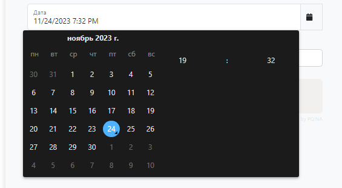

<p align="center">
    <a href="https://github.com/yii2-extensions/datetime-picker" target="_blank">
        
    </a>
    <h1 align="center">Tempus Dominus Date/Time Picker.</h1>
    <br>
</p>

<p align="center">
    <a href="https://www.php.net/releases/8.1/en.php" target="_blank">
        
    </a>
    <a href="https://github.com/yii2-extensions/datetime-picker/actions/workflows/build.yml" target="_blank">
        
    </a>
    <a href="https://github.com/yii2-extensions/datetime-picker/actions/workflows/compatibility.yml" target="_blank">
        
    </a>    
    <a href="https://codecov.io/gh/yii2-extensions/datetime-picker" target="_blank">
        
    </a>
    <a href="https://dashboard.stryker-mutator.io/reports/github.com/yii2-extensions/datetime-picker/main" target="_blank">
        
    </a>         
</p>

<p align="center">
    <a href="https://github.com/yii2-extensions/datetime-picker" target="_blank">
        
    </a>
</p>

## Installation 

The preferred way to install this extension is through [composer](https://getcomposer.org/download/).

Either run

```shell
composer require --dev --prefer-dist yii2-extensions/datetime-picker:^0.1
```

or add

```json
"yii2-extensions/datetime-picker": "^0.1"
```

to the require section of your `composer.json` file.

## Usage

### Name

```php
use Yii2\Extensions\DateTimePicker\DateTimePicker;

echo DateTimePicker::widget(['name' => 'datetime-picker']);
```

### Active Field

```php
use Yii2\Extensions\DateTimePicker\DateTimePicker;

echo $form
    ->field($formModel, 'date')
    ->widget(
        DateTimePicker::class,
        [
            'icon' => Icon::renderIcon('solid', 'calendar', ['class' => 'me-2 fa-solid'])
        ]
    );
```

### Active Field Floating Label

```php
use Yii2\Extensions\DateTimePicker\DateTimePicker;

echo $form
    ->field($formModel, 'date', ['options' => ['class' => 'mt-3']])
    ->label(false)
    ->widget(
        DateTimePicker::class,
        [
            'floatingLabel' => true,
            'icon' => Icon::renderIcon('solid', 'calendar', ['class' => 'me-2 fa-solid'])
        ]
    )
```

### Dynamic Theme Configuration for tempusDominus Widget Library

This library provides functionality to dynamically configure the tempusDominus widget's theme based on user preferences or predefined settings.

#### Functionality Overview

The library introduces a feature to automatically set up the tempusDominus widget with a theme determined by the user's preference or specified configurations.

##### Automatic Theme Configuration

Upon initialization, the library checks for theme configuration settings.
If the user has specified a theme in the library's configuration, it takes precedence.

##### Browser-Based Theme Detection

If no specific theme is set or the attribute data-bs-theme is absent:
The library uses the prefers-color-scheme media query to detect the user's system preference for `light` or `dark` mode.

##### Applying Theme Configuration to tempusDominus Widget

The library sets the theme configuration `(theme: 'dark' or theme: 'light')` based on the detected or specified theme.
This configuration is then applied to the tempusDominus widget using the library's internal functionalities.

### Properties of the widget

| Property         | Type          | Description                        | Default                     |
|------------------|---------------|------------------------------------|-----------------------------|
| `config`         | `array`       | The configuration of the widget.   | `[]`                        |
| `containerClass` | `string`      | The class of the container.        | `input-group`               |
| `cdn`            | `boolean`     | Whether to use the CDN.            | `true`                      |
| `floatingLabel`  | `boolean`     | Whether to use the floating label. | `false`                     |
| `format`         | `string`      | The format of the date.            | `yyyy/MM/dd HH:mm:ss`       |
| `formatMonth`    | `string`      | The format of the month.           | `long`                      |
| `formatYear`     | `string`      | The format of the year.            | `numeric`                   |
| `icon`           | `string`      | The icon of the widget.            | `''`                        |
| `id`             | `string`      | The ID of the widget.              | `datetimepicker1`           |
| `labelClass`     | `string`      | The class of the label.            | `form-label`                |
| `labelContent`   | `string`      | The content of the label.          | `''`                        |
| `spanClass`      | `string`      | The class of the span.             | `input-group-text`          |
| `startOfTheWeek` | `integer`     | The start of the week.             | `1`                         |
| `template`       | `string`      | The template of the widget.         `'{label}\n{input}\n{span}'` |

### Translation support

The extension supports translation. You can translate the extension into your language,
for default the extension supports the following languages.

- Chinese
- English
- French
- German
- Portuguese
- Russian
- Spanish

## Quality code

[](https://github.com/yii2-extensions/datetime-picker/actions/workflows/static.yml)
[](https://github.com/yii2-extensions/datetime-picker/actions/workflows/static.yml)
[](https://github.styleci.io/repos/722487175?branch=main)

## Support versions Yii2

[](https://github.com/yiisoft/yii2/tree/2.0.49.3)
[](https://github.com/yiisoft/yii2/tree/2.2)

## Testing

[Check the documentation testing](docs/testing.md) to learn about testing.

## Our social networks

[](https://twitter.com/Terabytesoftw)

## License

The MIT License. Please see [License File](LICENSE) for more information.
